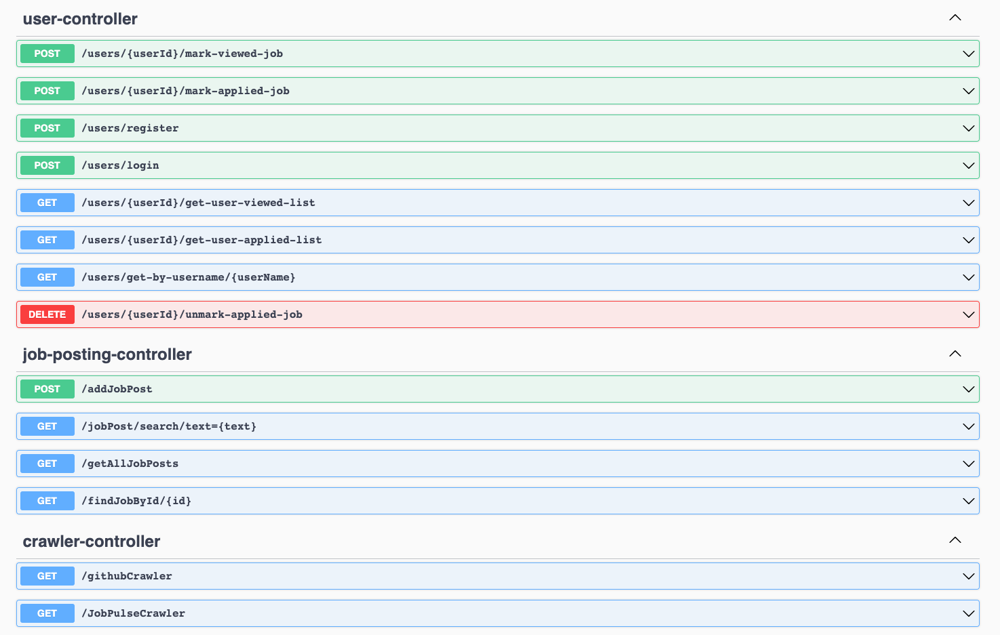

> ### **Java 21 + Spring Boot 3** codebase containing real-world examples for a job portal website (job posting crawling, user authentication, job application tracking, etc) that adheres to good design and coding practices.

### [Demo](#)&nbsp;&nbsp;&nbsp;&nbsp;[Documentation](#)

This codebase was created to demonstrate a fully fledged fullstack application built with **Java 21 + Spring Boot 3** including features like job postings, user authentication, authorization, and more.

We've gone to great lengths to adhere to the **Java 21 + Spring Boot 3** community styleguide & best practices.

It utilizes MongoDB to store jobPosting data and PostgreSQL to store user information.

The front end part is available at https://github.com/kou5321/JobPortalWebsite-frontend

---

## Table of Contents
* [Considerations](#considerations)
* [How it works](#how-it-works)
    * [Project structures](#project-structures)
        * [Packages](#packages)
        * [Classes](#classes)
* [System Architecture](#system-architecture)
* [Getting started](#getting-started)
    * [Run application](#run-application)
    * [Run tests](#run-tests)
    * [API documentation](#api-documentation)
    * [Deployment](#deployment)
* [Contribute](#contribute)

---

## Considerations
This application was built with the following considerations in mind, which may benefit developers interested in this project:

1. Error Handling: Implement robust error handling and logging to ease debugging and improve reliability.
2. Security: Protect against common vulnerabilities and implement proper auth mechanisms.
3. Performance: Optimize application performance with efficient database queries and caching.
4. Maintainability: Write clean and maintainable code, adhering to best practices.
5. Scalability: Consider the scalability of the application for future growth.

---

## How it works
This job portal application serves as a platform to connect employers with potential employees. It features automated job posting collection from various sources, user authentication, and job application tracking.

### Project structures
The project is structured around the MVC pattern with services and repositories handling business logic and database interactions.

To run the project, JDK 21 is required. After that, you can run it in your IDE.

Access the application at http://localhost:8080.

Packages
- com.kou5321.jobPortalWebsite.job - Contains controllers, services, and repositories for job-related operations.
- com.kou5321.jobPortalWebsite.user - Manages user registration, authentication, and profile operations.
- com.kou5321.jobPortalWebsite.config - Configuration for security, CORS, and other application settings.
Classes
- JobPostingController - Endpoints for job posting CRUD operations.
- UserController - Endpoints for user authentication and management.
- SecurityConfig - Security configurations for the application.

For detailed class structures and endpoints, refer to the Swagger API documentation available at /swagger-ui.html.

# 